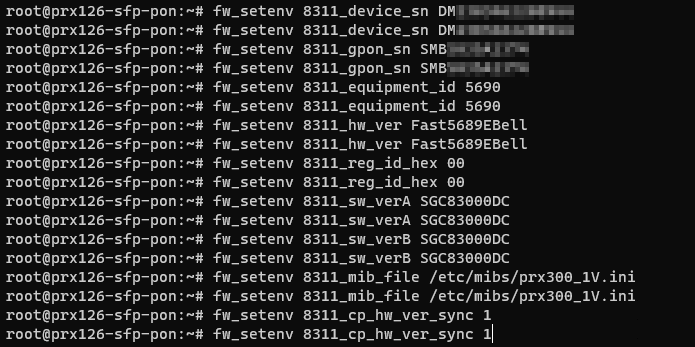

# Bell Gigahub XGS-PON Bypass w/ WAS-110

<!-- Table of Contents -->

# Table of Contents

- [Disclaimer: Liability and No-Responsibility Notice](#disclaimer-liability-and-not-responsibility-notice)
- [Credits](#credits)
- [Manufacturers](#manufacturers)
- [Gathering Gigahub Modem Attributes (DM#, SMB#, SGC#)](#gathering-gigahub-modem-attributes-dm-smb-sgc)
- [Connecting the WAS-110](#connecting-the-was-110)
- [Accessing the WAS-110](#accessing-the-was-110)
- [Checking for WAS-110 Issues](#checking-for-was-110-issues)
- [Setting WAS-110 Firmware Variables](#setting-was-110-firmware-variables)
- [Upgrading the WAS-110 to Custom Firmware](#upgrading-the-was-110-to-custom-firmware)
- [Fibre Connectivity to WAS-110](#fibre-connectivity-to-was-110)
- [PPPoE via the WAS-110](#pppoe-via-the-was-110)
- [Frequently Asked Question (FAQ)](#frequently-asked-question-faq)
  - [Internet VLAN - Untagged vs Tagged VLAN](#internet-vlan---untagged-vs-tagged-vlan)
  - [No WAS-110 Link to Switch with Custom Firmware and Fibre Disconnected](#no-was-110-link-to-switch-with-custom-firmware-and-fibre-disconnected)
  - [Downloading the Custom Firmware](#downloading-the-custom-firmware)
  - [WAS-110 Group Buy](#was-110-group-buy)

# Disclaimer: Liability and No-Responsibility Notice

The information provided in this guide is intended for educational and informational purposes only. Users are solely responsible for the
application and implementation of the steps outlined in the guide. The authors, contributors, and distributors of this guide, including but not
limited to those credited, manufacturers, and the 8311 Discord Community, hereby declare that they are not liable for any direct, indirect,
incidental, consequential, or special damages, losses, or expenses arising from the use or misuse of the information provided.

The guide includes details about modifying hardware, upgrading firmware, and configuring network settings, which may involve risks and
potential hazards. Users are strongly advised to exercise caution, adhere to safety guidelines, and seek professional assistance if needed.
The authors do not guarantee the accuracy, completeness, or suitability of the information provided, and users acknowledge that they are
using the guide at their own risk.

Furthermore, the authors and contributors expressly disclaim any responsibility for the consequences of actions taken based on the
information presented in this guide. Users are encouraged to seek assistance from the 8311 Discord Community or other relevant support
channels if they encounter issues during the process.

The mention of specific individuals, manufacturers, or entities in the credits and acknowledgments section does not imply endorsement or
warranty of their products, services, or contributions. The guide is provided "as is," and no warranties, either express or implied, are made
regarding its contents.

By proceeding with the use of this guide, users acknowledge and agree to release the authors, contributors, and distributors from any
liability, claims, or damages that may arise in connection with the use of the information provided.

# Credits

None of this would’ve been possible if it wasn’t for the hard-working individuals over at the 8311 Discord Community ([link](https://discord.com/servers/8311-886329492438671420)).

Special thanks:

- up-n-atom ([Github](https://github.com/up-n-atom))
  - Original author for the steps ([8311 Discord Canada → FAQ](https://discord.com/channels/886329492438671420/1034609993451847680))
  - Original author for the Sagemcom XOM API CLI
- djGrrr ([Github](https://github.com/djGrrr))
  - Original author for the WAS-110 custom firmware
  - The latest custom firmware can be found over at the 8311 Discord Community ([link](https://discord.com/channels/886329492438671420/1162279893388759122/1178570504496496692))
- Miguel R.
  - Trusted distributor of the WAS-110 module

# Manufacturers

The WAS-110 is an Azores XGS-PON ONT SFP module ([link](https://azoresnetworks.com/product/pon-cpe-65.html)). Some manufacturers have rebadged the Azores XGS-PON modules, such
as:

- ECIN EN-XGSFPP-OMAC-V2 ([link](https://ecin.ca/custom-xgs-pon-sfp-stick-module-xgspon-ont-w-t-mac-function-mounted-on-sfp-package/))

# Gathering Gigahub Modem Attributes (DM#, SMB#, SGC#)

1. Grab your device DM## and SMB## values from the back of your Gigahub modem:

   <a href="./doc-assets/images/gigahub-modem-back-shot.png" target="_blank">
    
   </a>

2. Identify the firmware version your Gigahub is currently running

   1. Log into your Gigahub and find your Firmware version ([accessing your Gigahub Web UI](https://forum.bell.ca/t5/Internet/Questions-about-GigaHub-modem-get-version-retrieve-password-won/m-p/22480/highlight/true#M6316)):

      (Image Credit: [districtdogz](https://discord.com/channels/886329492438671420/1136785888907632914/1182059889770635385))

       <a href="./doc-assets/images/gigahub-modem-locate-firmware-version.png" target="_blank">
           
       </a>

   2. Match your firmware version to the relative SGC# in the 8311 Discord channel ([link](https://discord.com/channels/886329492438671420/1162279893388759122/1178568978071818240))
      - Known firmware versions and their corresponding SGC#:
           <table>
               <thead>
                   <tr>
                       <th>Device</th>
                       <th>Version</th>
                       <th>SGC#</th>
                   </tr>
               </thead>
               <tbody>
                   <tr>
                       <td>Home Hub 4000</td>
                       <td>1.7.2</td>
                       <td>SGC821011A</td>
                   </tr>
                   <tr>
                       <td>Home Hub 4000</td>
                       <td>1.7.8.1</td>
                       <td>SGC8210140</td>
                   </tr>
                   <tr>
                       <td>Home Hub 4000</td>
                       <td>1.7.11</td>
                       <td>SGC8210154</td>
                   </tr>
                   <tr>
                       <td>Giga Hub</td>
                       <td>1.16.3</td>
                       <td>SGC830006E</td>
                   </tr>
                   <tr>
                       <td>Giga Hub</td>
                       <td>1.16.5</td>
                       <td>SGC830007C</td>
                   </tr>
                   <tr>
                       <td>Giga Hub</td>
                       <td>1.19.5.1</td>
                       <td>SGC83000C8</td>
                   </tr>
                   <tr>
                       <td>Giga Hub</td>
                       <td>1.19.5.4</td>
                       <td>SGC83000D0</td>
                   </tr>
                   <tr>
                       <td>Giga Hub</td>
                       <td>1.19.6</td>
                       <td>SGC83000DC</td>
                   </tr>
               </tbody>
           </table>

# Connecting the WAS-110

## SFP Switch Method

Accessing the WAS-110 via a switch is possible if you have a 10G switch ready to go.

<!-- image reference to was-110-connectivty-via-switch.png -->
<a href="./doc-assets/images/was-110-connectivty-via-switch.png" target="_blank">
    
</a>

Some switches require you to have the fibre connected to establish a link. After you have the custom firmware, you can setup the WAS-110
to link without fibre connected (see [FAQ](#frequently-asked-question-faq)).

## Media Converter Method

If you don’t have a switch or the switch is not linking with your WAS-110, a media converter will work instead.

<!-- image reference to was-110-connectivty-via-media-converter.png -->
<a href="./doc-assets/images/was-110-connectivty-via-media-converter.png" target="_blank">
    
</a>

# Accessing the WAS-110

1. Confirm you can access the WAS-110 by pinging it from your client device/virtual machine:

   <a href="./doc-assets/images/was-110-access-ping-confirmation.png" target="_blank">
    
   </a>

2. Go to [http://192.168.11.1](http://192.168.11.1) login with `admin` and password `QsCg@7249#5281`:

   <a href="./doc-assets/images/was-110-access-web-ui.png" target="_blank">
    
   </a>

3. Go to the Service tab and tick the box on SSH:

   <a href="./doc-assets/images/was-110-access-web-ui-ssh.png" target="_blank">
    
   </a>

4. Start up a terminal and SSH into the WAS-110 with login `root` and password `QpZm@4246#5753`:

   - Linux
     - `ssh -oHostKeyAlgorithms=+ssh-rsa -oPubkeyAcceptedKeyTypes=+ssh-rsa root@192.168.11.1`
   - Windows 11
     - `ssh root@192.168.11.1`

   <a href="./doc-assets/images/was-110-access-ssh-windows.png" target="_blank">
    
   </a>

   - If you had logged into the stick and it rebooted on you, you’ll have to clear your known_hosts file otherwise you’ll get an error since the WAS-110’s SSH RSA fingerprint key changes after every reboot.

# Checking for WAS-110 issues

Check for issues on the WAS-110 by running the command below and ensuring that it returns nothing:

```shell
VOLS="kernelA bootcoreA rootfsA kernelB bootcoreB rootfsB rootfs_data ptconf" ; i=0; for VOL in $VOLS; do
VOLID=$(ubinfo /dev/ubi0 -N "$VOL" 2>/dev/null | grep 'Volume ID:' | awk '{print $3}'); [ -z "$VOLID" ] && echo
"Volume $VOL missing" || [ "$VOLID" -eq "$i" ] 2>/dev/null || echo "Volume $VOL misplaced (should be ID $i, not
$VOLID)"; i=$((i+1)); done
```

<!-- was-110-checking-for-issues.png -->
<a href="./doc-assets/images/was-110-checking-for-issues.png" target="_blank">
    
</a>

If you run into issues, seek support from the 8311 Discord community ([link](https://discord.com/channels/886329492438671420/1173846818535247904/1173846818535247904)).

# Setting WAS-110 Firmware Variables

## PPTP or VEIP

You need to know if you're on PPTP or VEIP. Check up-n-atom's guide on Discord ([link](https://discord.com/channels/886329492438671420/1162279893388759122/1178570504496496692)).

If you're on a Bell 3.0gbps plan or above, you're on VEIP.

## Applying the Variables

1. Ensure no issues are coming up with the WAS-110 (see [here](#checking-for-was-110-issues))
2. Issue the following commands while SSHed into the WAS-110 (replace your DM## , SMB##, and SGC## where applicable:

   ```shell
   # mib_file
   fw_setenv mib_file
   fw_setenv mib_file

   # 8311_device_sn
   # Replace DM############# with your DM## value from the back of your modem
   fw_setenv 8311_device_sn DM#############
   fw_setenv 8311_device_sn DM#############

   # 8311_gpon_sn
   # Replace SMB######### with your SMB## value from the back of your modem
   fw_setenv 8311_gpon_sn SMB#########
   fw_setenv 8311_gpon_sn SMB#########

   # 8311_equipment_id
   # Replace 56## with the corresponding id for your modem
   #    5689 is for the Home Hub 4000
   #    5690 is for the Giga Hub
   fw_setenv 8311_equipment_id 56##
   fw_setenv 8311_equipment_id 56##

   # 8311_hw_ver
   # Replace Fast56####### with the corresponding hardware version for your modem
   #   Fast5689Bell  is for the Home Hub 4000
   #   Fast5689EBell is for the Giga Hub
   fw_setenv 8311_hw_ver Fast56#######
   fw_setenv 8311_hw_ver Fast56#######

   # 8311_reg_id_hex
   fw_setenv 8311_reg_id_hex 00
   fw_setenv 8311_reg_id_hex 00

   # 8311_sw_verA
   # Replace SGC####### with your SGC## value from the back of your modem
   fw_setenv 8311_sw_verA SGC#######
   fw_setenv 8311_sw_verA SGC#######

   # 8311_sw_verB
   # Replace SGC####### with your SGC## value from the back of your modem
   fw_setenv 8311_sw_verB SGC#######
   fw_setenv 8311_sw_verB SGC#######

   # 8311_mib_file
   # VEIP = /etc/mibs/prx300_1V.ini (if you're on a Bell 3.0gpbs plan or above, you're on VEIP)
   # PPTP = /etc/mibs/prx300_1U.ini (if you're on a Bell 1.5gbps plan or below, you're on either VEIP or PPTP)
   # Check up-n-atom's guide on Discord
   fw_setenv 8311_mib_file /etc/mibs/prx300_1V.ini
   fw_setenv 8311_mib_file /etc/mibs/prx300_1V.ini

   # 8311_cp_hw_ver
   fw_setenv 8311_cp_hw_ver_sync 1
   fw_setenv 8311_cp_hw_ver_sync 1
   ```

   Note: Duplication of the commands are intentional

   Screenshot of applying the variables:
   <!-- was-110-applying-firmware-environment-variables.png -->
    <a href="./doc-assets/images/was-110-applying-firmware-environment-variables.png" target="_blank">
         
    </a>

# Upgrading the WAS-110 to Custom Firmware

1. Ensure no issues are coming up with the WAS-110 (see [here](#checking-for-was-110-issues))
2. Download the latest firmware from the 8311 Discord Server ([link](https://discord.com/channels/886329492438671420/1162279893388759122/1178570504496496692))
3. Extract `local-upgrade.img` from the archive file you just downloaded
4. On the WAS-110’s WEB UI:

   - Upgrade to the custom firmware (note: you have to do this twice):

     - Select `browse` and select the `local-upgrade.img` file
     - Select Upgrade
     - Module will reboot

     <!-- was-110-firmware-upgrade-webui.png -->
        <a href="./doc-assets/images/was-110-firmware-upgrade-webui.png" target="_blank">
            
        </a>

   - After the module comes back up, ensure there are no issues (see [here](#checking-for-was-110-issues))
   - Add the failsafe file to the module to ensure we can recover it if something goes wrong:

     ```shell
     touch /ptconf/.failsafe
     ```

   - Repeat the firmware upgrade from the previous step (yes, you must do this twice)
   - After the module comes back up a second time, ensure there are no issues (see [here](#checking-for-was-110-issues))

5. Leave the WAS-110 plugged in and ensure it stays up for 5 minutes without rebooting, you can spam pings to 192.168.11.1 to see if the
   device stays up.
6. If all is good, you can remove the failsafe and reboot the stick:

   ```shell
   rm -f /ptconf/.failsafe
   reboot
   ```

# Fibre Connectivity to WAS-110

1. Plug the fibre into your WAS-110
2. In the WAS-110’s Web UI at Status → PON, ensure it shows an ONU State of O5.
   - If it’s not showing O5, either:
     - Your fibre isn't connected properly
     - Your firmware variables are incorrect

<!-- was-110-fibre-connectivity-webui.png -->
<a href="./doc-assets/images/was-110-fibre-connectivity-webui.png" target="_blank">
    
</a>

# PPPoE via the WAS-110

Using your choice of router (i.e. OPNSense, PFSense, Ubiquiti Dream Machine, etc.), setup PPPoE (b1id/password) like you normally
would’ve done with the Gigahub.

# Frequently Asked Question (FAQ)

## Internet VLAN - Untagged vs Tagged VLAN

The custom firmware will default to untagging the Internet VLAN for PPPoE.

If you still wish to have the Internet Service VLAN tagged to 35, check the djGrrr’s docs on Github ([link](https://github.com/djGrrr/8311-was-110-firmware-builder))

## No WAS-110 link to Switch with Custom Firmware and Fibre Disconnected

The WAS-110 asserts RX_LOS which some switches (e.g. Mikrotik) monitor to establish a link. You need to disable this.

1. Re-establish connectivity from the device that you previously SSHed the WAS-110 from
2. Issue the following SSH commands to update the 8311_rx_los variable to a value of 0
   ```shell
   fw_setenv 8311_rx_los 0
   fw_setenv 8311_rx_los 0
   ```
3. Reconnect the WAS-110 into the switch, you should now get a link even with the fibre disconnected

## Downloading the Custom Firmware

The latest custom firmware by djGrrr for the WAS-110 can be obtained from the 8311 Discord Community ([link](https://discord.com/channels/886329492438671420/1162279893388759122/1178570504496496692)).

## WAS-110 Group Buy

If you’re interested in obtaining one through a group buy, check out the 8311 Discord Buy and Sell channel ([link](https://discord.com/channels/886329492438671420/1133904770374062130)).
